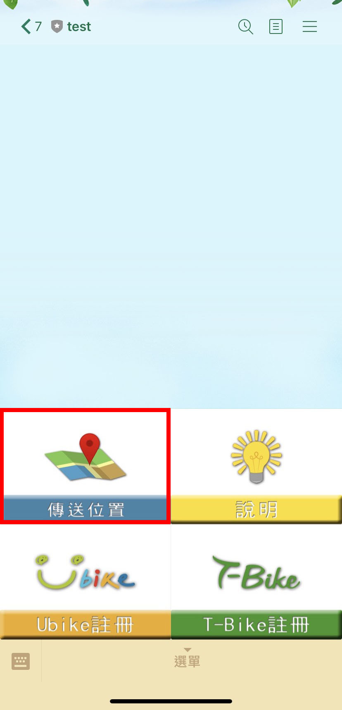
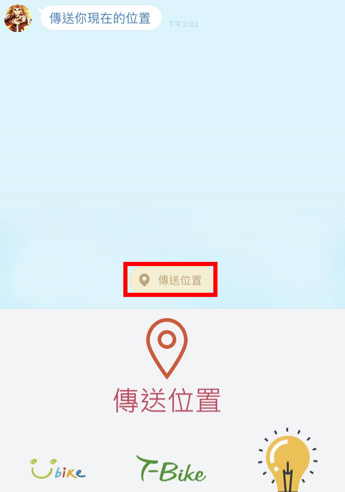
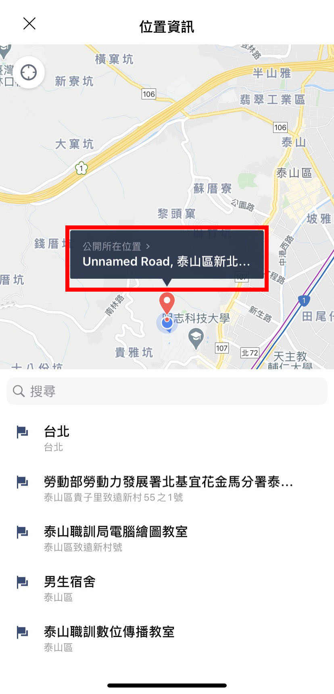
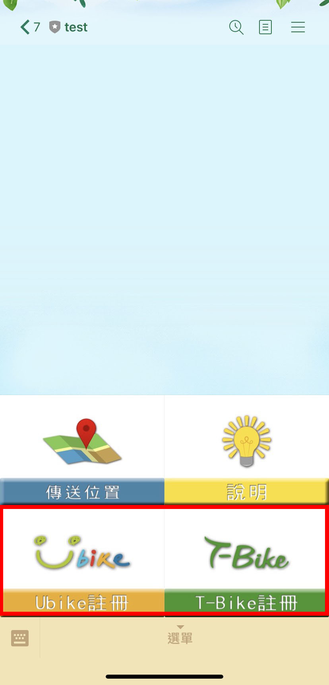

##ID: @767vfttl

##QRcode 

##使用資料: 
###YouBike 臺北市公共自行車即時資訊 

https://tcgbusfs.blob.core.windows.net/blobyoubike/YouBikeTP.json 

###新北市公共自行車租賃系統(YouBike) 

https://data.ntpc.gov.tw/api/datasets/71CD1490-A2DF-4198-BEF1-318479775E8A/csv/file 

###桃園公共自行車即時服務資料 

https://data.tycg.gov.tw/opendata/datalist/datasetMeta/download?id=5ca2bfc7-9ace-4719-88ae-4034b9a5a55c&rid=a1b4714b-3b75-4ff8-a8f2-cc377e4eaa0f 

###臺中市公共自行車(iBike)租借站&即時車位資料 

https://datacenter.taichung.gov.tw/swagger/OpenData/91deb8b8-7547-4a60-8cae-7c95c0df2fda 

###T-Bike 臺南市公共自行車租賃站資訊 

http://tbike-data.tainan.gov.tw/Service/StationStatus/Json

##使用說明 

###1.按下選單上的傳送位置。

###2.機器人還傳訊息後，按下聊天室下方的傳送位置(如下圖紅框標示)。

###3.可直接按下公開所在位置傳送目前位置，或拖曳地圖標記想搜尋的區域，再按下公開所在位置，機器人就會回傳標記點方圓 500 公尺內的 ubike 站點位置、可借車數、可還位數等訊息。

###4.如為第一次使用 ubike 或 T-bike 使用註冊功能先註冊(下圖標記處)

